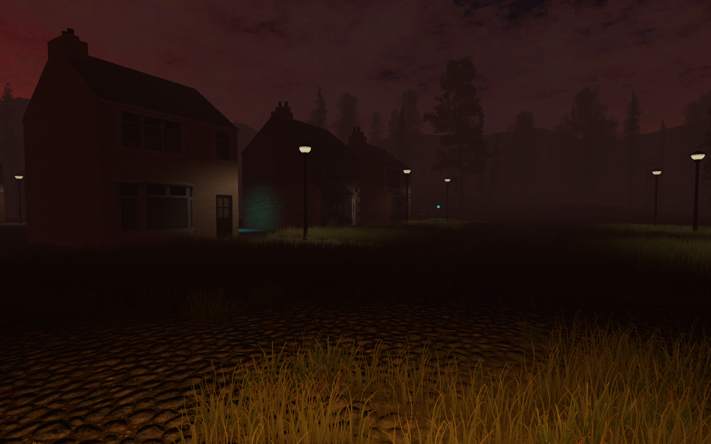

## Slender: Insanity

Slender: Insanity is a videogame that plays out similarly to most Slender games:
You must fulfill the level's objective while Slenderman is after you, but compared to similar games it adds variety, a different story perspective and an extra twist.

The game is composed of currently 4 levels.
All levels are unlocked from the start so they can be enjoyed without limitation

  

## Links

* [**Game page and download**](https://gamejolt.com/games/slenderinsanity/229607)
* [**Game Manual**](doc/manual.md)
* [**Credits**](doc/credits.md)

## Requirements

* **Operating system:** Linux-based, Windows or macOS
* **CPU architecture:** x86_64 (Linux, macOS and Windows) or 64bit ARM (macOS only)

The game is optimised for performance and low overhead.
CPU performance is great, graphical performance is decent, and disk/RAM/VRAM usage is low.

## Project information

The game is made in the Unity engine.

This repository does not contain the Unity project nor the textures, models, maps, sounds or any other asset.
This means that the code itself is not very useful on its own and it's not enough to fork the project, but I'm releasing it here anyways in case someone is curious about it.

The source found here reflects the game versions >=2.0. Past versions such as 1.5 or the earliest 0.2 are not included here.
The game got remade nearly entirely from scratch since version 2.0 and is much different now.
